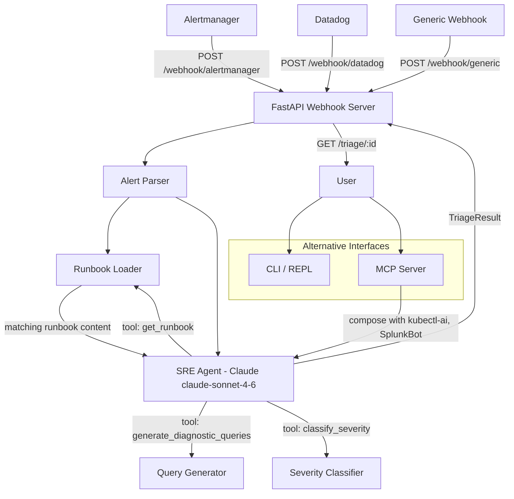

# IntelliSREBot — AI-Powered Alert Triage & Incident Response

> Feed it an alert. Get a root cause, ordered remediation steps, and diagnostic queries — in under 30 seconds.

[](https://github.com/Mudassar-Malek/intelli-sre-bot/actions/workflows/ci.yml)
[](https://www.python.org/)
[](LICENSE)
[](https://modelcontextprotocol.io)

---

## Problem Statement

Alert fatigue is real. An SRE team in a fintech production environment can receive hundreds of alerts per day. The expensive part isn't acknowledging the alert — it's the first 5 minutes: figuring out whether it's a false positive, which service is the actual owner, what runbook applies, and what to check first.

IntelliSREBot compresses those 5 minutes into 30 seconds. It ingests alerts from Alertmanager, Datadog, or any generic webhook, matches them against your runbook library, generates environment-specific diagnostic queries (SPL, PromQL, kubectl), and produces a structured triage report via an agentic Claude loop.

**Real incident context:** During a payment-processing incident where OOMKilled pods cascaded into a connection pool exhaustion event, this bot pattern was used with kubectl-ai to identify the root cause chain — a new deploy had increased memory per request by 40%, which hit pod memory limits at peak transaction volume, and pod restarts exhausted the database connection pool. Time to root cause: ~90 seconds vs. the usual 8-12 minutes of manual log hunting.

---

## Architecture



---

## Features

- **Multi-source ingestion**: Alertmanager, Datadog, and generic webhooks — normalized to a single model
- **Runbook matching**: Fuzzy-matches alerts to your Markdown runbooks and injects context into the triage loop
- **Agentic analysis**: Claude uses tools to enrich analysis — not just a prompt, an actual reasoning loop
- **Diagnostic query generation**: Produces ready-to-run SPL, PromQL, and kubectl commands scoped to the specific service and namespace
- **Severity re-classification**: Upgrades/downgrades severity based on service criticality (payments vs. non-critical) and environment (prod vs. staging)
- **Three interfaces**: Webhook server (production), interactive CLI (on-call), MCP server (composable with other AI tools)

---

## Tech Stack

| Component | Choice | Why |
|-----------|--------|-----|
| LLM | Claude claude-sonnet-4-6 | Structured tool-use loop; reliable JSON extraction |
| Web Framework | FastAPI | Async-native; background task support for non-blocking webhook response |
| Alert Sources | Alertmanager, Datadog, generic | Most common in fintech environments |
| Protocol | MCP (stdio) | Composable with kubectl-ai and SplunkBot in the same agent pipeline |
| Runbooks | Markdown files | No database dependency; version-controlled with infra |
| Language | Python 3.11+ | Dataclasses, match statements, native async |

---

## Quickstart

### CLI (interactive triage)

```bash
git clone https://github.com/Mudassar-Malek/intelli-sre-bot.git
cd intelli-sre-bot

python -m venv .venv && source .venv/bin/activate
pip install -r requirements.txt

cp .env.example .env
# Set ANTHROPIC_API_KEY

python -m src.cli
```

**Example session:**

```
You: {"title": "KubePodCrashLooping", "source": "prometheus", "severity": "high",
      "labels": {"namespace": "payments", "service": "payments-api"}}

[Alert loaded: KubePodCrashLooping / high]

IntelliSREBot:
Root cause: payments-api pods in the payments namespace are crash-looping,
most likely due to OOMKill (exit 137) or a missing environment variable
after a recent deployment.

Immediate actions:
1. kubectl get pods -n payments --sort-by='.status.startTime'
2. kubectl describe pod <crashing-pod> -n payments | grep -A5 "Last State"
3. If exit 137: kubectl set resources deployment/payments-api -n payments --limits=memory=512Mi
4. If config error: kubectl logs <pod> -n payments --previous | head -50
5. If bad deploy: kubectl rollout undo deployment/payments-api -n payments

Confidence: high — CrashLoopBackOff on a payments service in prod matches
the pod_crashloopbackoff runbook exactly.
```

### Webhook Server (production)

```bash
uvicorn src.webhook_server:app --host 0.0.0.0 --port 8080
```

Send an Alertmanager webhook:

```bash
curl -X POST http://localhost:8080/webhook/alertmanager \
  -H "Content-Type: application/json" \
  -d '{"alerts": [{"labels": {"alertname": "HighErrorRate", "severity": "critical",
      "service": "payments-api"}, "annotations": {"description": "5xx rate > 10%"},
      "startsAt": "2026-04-18T14:23:00Z"}]}'

# Response: {"status": "accepted", "alert_count": 1, "ids": ["HighErrorRate_2026-04-18T14:23:00"]}

# Poll for result:
curl http://localhost:8080/triage/HighErrorRate_2026-04-18T14:23:00
```

### MCP Server

```json
{
  "mcpServers": {
    "intelli-sre": {
      "command": "python",
      "args": ["-m", "src.mcp_server"],
      "cwd": "/path/to/intelli-sre-bot",
      "env": { "ANTHROPIC_API_KEY": "sk-ant-..." }
    }
  }
}
```

---

## Adding Runbooks

Drop Markdown files into `runbooks/`. File name is used for matching — use the alert name in snake_case:

```
runbooks/
  high_error_rate.md
  pod_crashloopbackoff.md
  database_connection_exhausted.md
  your_custom_alert.md    ← add yours here
```

The loader does fuzzy matching — `KubePodCrashLooping` will match `pod_crashloopbackoff.md`.

---

## Design Decisions & Tradeoffs

**Why background tasks instead of synchronous triage on webhook receipt?**
Alertmanager has a short webhook timeout (~10s). Claude API calls with tool loops can take 20-40s on complex alerts. If the webhook times out, Alertmanager retries — and you get duplicate triage jobs. Background tasks with a polling endpoint is the correct pattern here.

**Why Markdown runbooks instead of a vector database?**
Vector search adds operational complexity (embedding model, vector store, indexing pipeline). For a team with <200 runbooks, fuzzy string matching on filenames gets you 90% of the value with zero infra. When you hit the scale where this breaks, the migration path to embeddings is straightforward — the `RunbookLoader` interface is already abstracted.

**Why re-classify severity instead of trusting the alert?**
In fintech, alert severity labels in Prometheus are set at authoring time and rarely revisited. A "high" alert on the `payments-api` in production is operationally a P1. The severity classifier encodes domain knowledge that alert labels can't capture.

**Why not stream webhook responses?**
Streaming requires the client to stay connected. Webhook sources (Alertmanager, Datadog) don't support streaming — they fire and forget. Async + polling is the only viable pattern.

---

## What I'd Do Differently at Scale

- **Deduplication**: Multiple alert firings of the same alert within a 5-minute window should produce one triage job, not N. Add a dedup key based on `(alert_title, labels_hash, 5min_bucket)`.
- **Result persistence**: `_triage_results` is an in-memory dict — a pod restart loses everything. Redis or PostgreSQL with TTL for triage results.
- **Runbook versioning**: Runbooks change. Triage results should record which runbook version was used, especially for postmortems.
- **Feedback loop**: Allow on-call engineers to mark a triage result as "correct / incorrect" and use that signal to improve prompt and runbook matching over time.
- **Multi-tenant**: One deployment per team with scoped runbook directories and separate API keys, not a shared instance.

---

## Production Readiness Checklist

| Item | Status |
|------|--------|
| Multi-source alert parsing (Alertmanager, Datadog, generic) | Done |
| Runbook matching and injection | Done |
| Agentic triage loop with tool use | Done |
| Severity re-classification for fintech services | Done |
| Non-blocking webhook handling (background tasks) | Done |
| CLI for interactive use | Done |
| MCP server for composability | Done |
| Unit tests (parser, runbook loader) | Done |
| CI pipeline | Done |
| Result persistence (Redis/Postgres) | Not yet |
| Alert deduplication | Not yet |
| Structured JSON logging | Not yet |
| Dockerfile + Kubernetes deployment manifest | Not yet |
| Auth on webhook endpoints | Not yet |
| Feedback/correction loop | Not yet |

---

## Examples

See [`docs/examples.md`](docs/examples.md) for 6 real-world triage scenarios:
- Pod CrashLoopBackOff on payments service
- High error rate — fintech payment API
- Database connection pool exhausted
- False positive detection (staging noise)
- Kubernetes node NotReady
- MCP composition with SplunkBot for end-to-end incident response

---

## Related Projects

- [kubectl-ai](https://github.com/Mudassar-Malek/kubectl-ai) — natural language Kubernetes management (MCP-compatible)
- [splunk-ai-bot](https://github.com/Mudassar-Malek/splunk-ai-bot) — AI-powered Splunk investigation (MCP-compatible)

Compose IntelliSREBot + SplunkBot + kubectl-ai as MCP tools in a single agent pipeline for end-to-end incident response.

---

## Author

**Mudassar Malek** — Senior DevOps / SRE Engineer  
8+ years in fintech infrastructure, Kubernetes platforms, and AI-augmented incident response.
